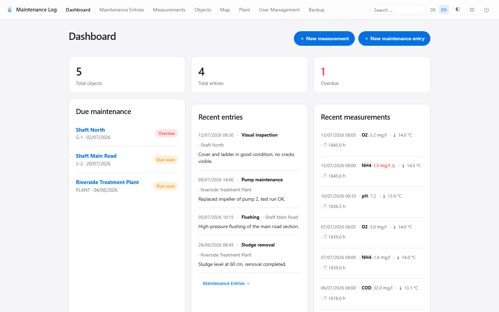
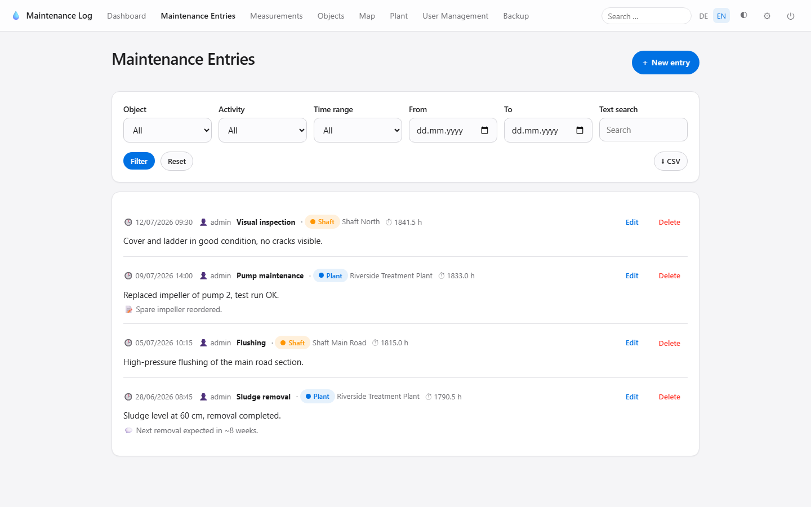
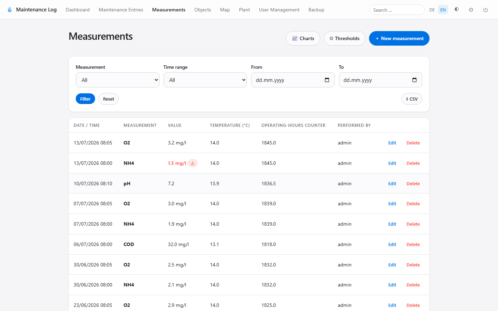
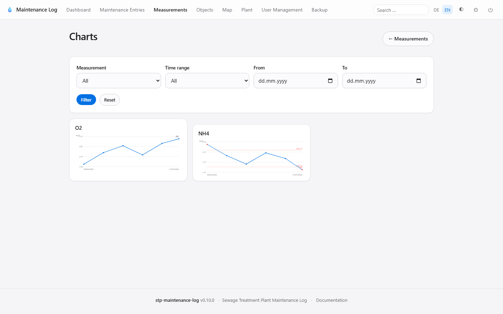
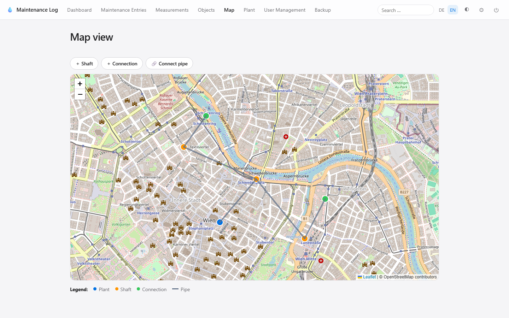
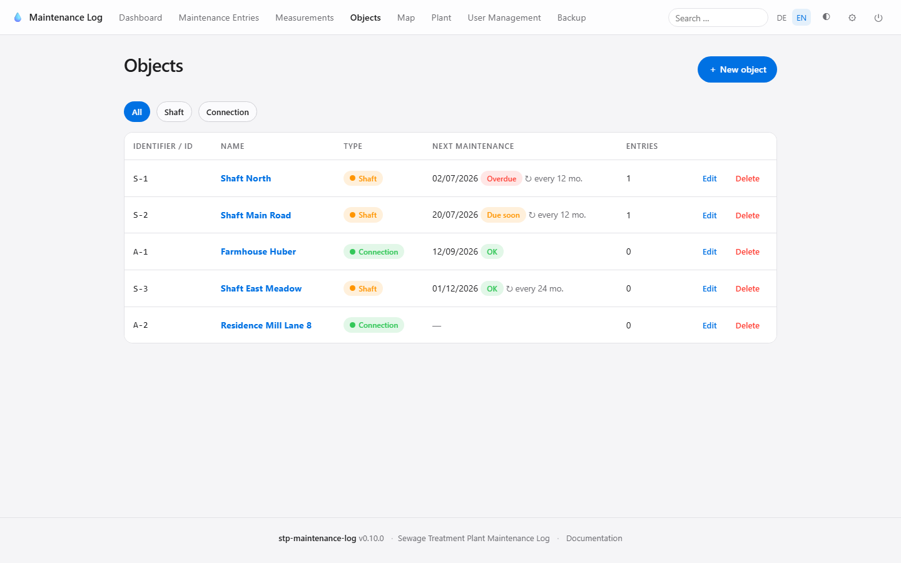
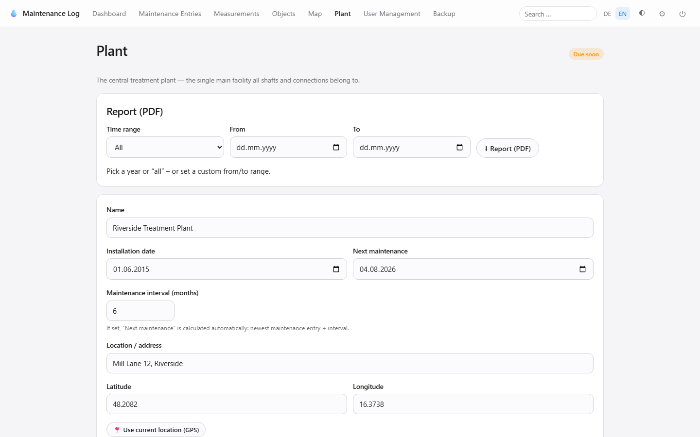
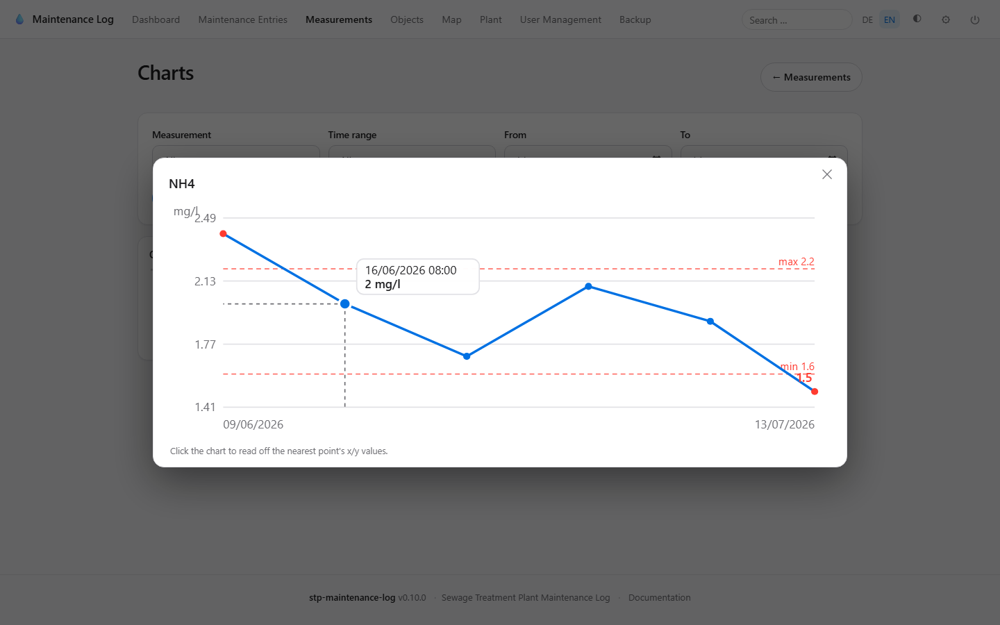
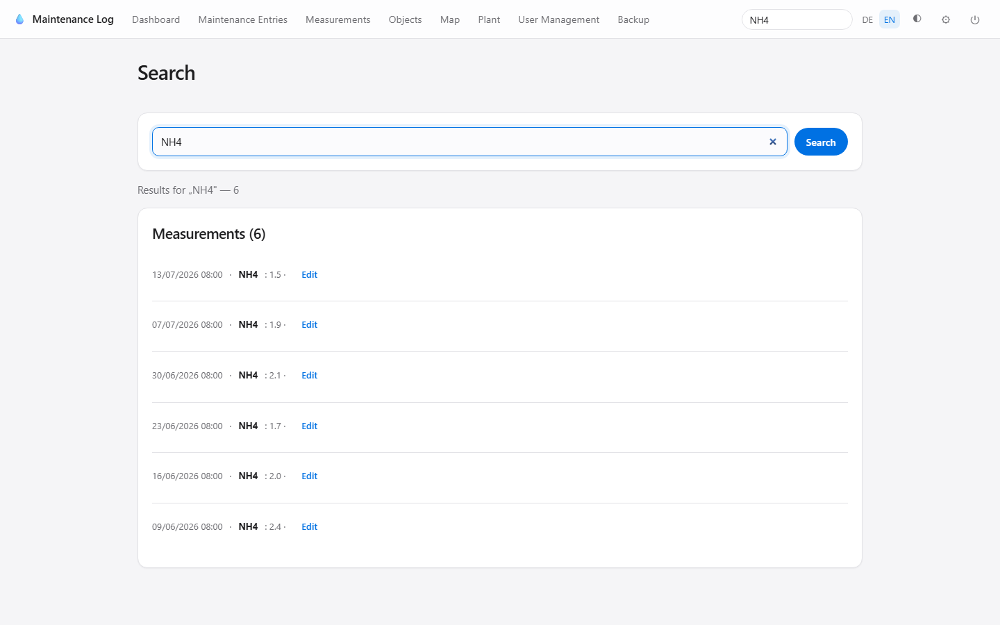
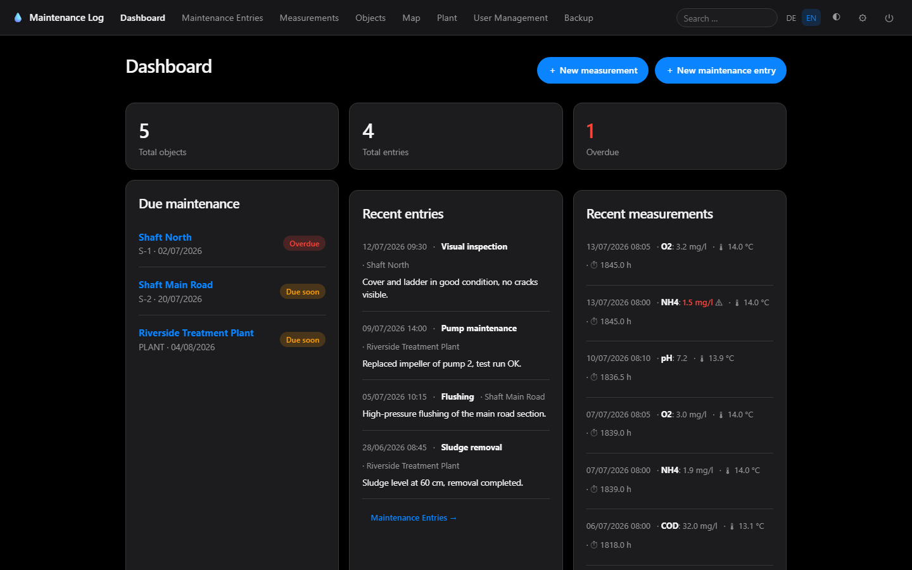

# 💧 Sewage Treatment Plant Maintenance Log

A self-hosted web application for keeping a maintenance log of a sewage
treatment network — the plant, its shafts (manholes) and connections. Built to
run comfortably in a **Proxmox LXC container or VM** with minimal resources.

FastAPI · SQLite · Jinja2 · HTMX · Alpine.js · Leaflet — no Node build step,
no external CDN, no API keys.

> 🇩🇪 **Deutsche Kurzanleitung** weiter unten → [Deutsch](#-deutsch)

---

## ✨ Features

- **Maintenance log** — entries with date/time, performing user, activity,
  description, notes, comment, mandatory **operating-hours counter** reading
  and **multiple image uploads** per entry.
- **Measurements** — log process values (e.g. NH4, O2, pH) with value,
  temperature and operating-hours counter; self-building parameter list and a
  recent-measurements card on the dashboard. Set an optional **unit** and a
  **warning threshold** (min/max) per parameter; out-of-range values are flagged
  red in the list, on the dashboard and in charts.
- **Trend charts** — a dedicated charts page draws a per-parameter line chart
  (with unit and dashed threshold lines). Click a chart to **enlarge** it, then
  click inside to read off the nearest point's **x/y values** via a crosshair.
- **Global search** — one header search box across maintenance entries,
  measurements and objects.
- **Self-building activity list** — new activities are stored automatically the
  first time you type them; the most recently used ones sort to the top.
- **History & filters** — newest first, **paginated** (25/page), filter by
  object, activity, full-text search, and a unified **time filter**
  (quick-select a year / all, or a custom from–to range) on entries and
  measurements alike. Each list has a filtered **CSV export**.
- **Object management** — shafts (manholes) and connections plus the single
  plant, each with a unique ID, installation date, next-maintenance reminder,
  **maintenance interval** (next date is computed automatically from the newest
  entry), address, GPS coordinates, comment and **image attachments**.
  Due/overdue maintenance is highlighted.
- **Object change log** — create/update/delete of objects is recorded with the
  user and a field-level old→new diff.
- **Map view** — Leaflet + OpenStreetMap, markers colour-coded by type, place
  new objects by clicking the map and draw **sewer lines** between objects.
  Privacy-friendly, no API key.
- **Mobile helpers** — one-tap **GPS capture** for coordinates and **voice
  input** (Web Speech API) for text fields, with graceful fallback.
- **Authentication** — username/password (argon2 hashing), roles
  (admin / user), CSRF protection, secure sessions, show/hide toggle on every
  password field.
- **Two-factor authentication (2FA)** — TOTP compatible with Google
  Authenticator / Authy, QR-code setup and one-time backup codes.
- **Brute-force protection** — login and 2FA attempts are rate-limited per
  client IP (configurable).
- **User management** — admins create, edit, deactivate and delete users, with
  password confirmation on every password change.
- **Plant report (PDF)** — one chronological report of everything (maintenance
  entries, measurements, object changes) with a cover page (plant master data,
  summary, generation timestamp), a selectable time range and **image
  thumbnails** for entries. Admin-only.
- **Backup & restore** — full ZIP backup (database + images), one-click restore.
- **Internationalisation** — full German 🇩🇪 and English 🇬🇧, switchable in the UI.
- **Apple-style UI** — clean, minimal, rounded, with a persistent **dark mode**
  and a fully responsive layout (desktop, tablet, phone).

## 📸 Screenshots

**Dashboard** — due/overdue maintenance and recent activity at a glance:



| Maintenance history | Measurements |
|---------------------|--------------|
|  |  |

| Measurement charts | Map view with pipes |
|--------------------|---------------------|
|  |  |

| Object management | Plant & PDF report |
|-------------------|--------------------|
|  |  |

| Enlarged chart with x/y readout | Global search |
|---------------------------------|---------------|
|  |  |

**Dark mode** — a persistent dark theme across the whole app:



---

## 🚀 Quick start (local)

Requires Python 3.11+.

```bash
git clone https://github.com/skyhell/stp-maintenance-log.git
cd stp-maintenance-log
python -m venv .venv
source .venv/bin/activate          # Windows: .venv\Scripts\activate
pip install -r requirements.txt
cp .env.example .env               # edit SECRET_KEY (see below)
python -c "import secrets; print(secrets.token_urlsafe(48))"   # paste into SECRET_KEY
uvicorn app.main:app --reload
```

Open <http://127.0.0.1:8000> and log in with the bootstrap admin
(`admin` / `changeme`). **Change this password immediately.**

---

## 📦 Install on Proxmox

### Option A — one script on the Proxmox host (creates the container for you)

Run this **on the Proxmox node** (as root). It creates a Debian 12 LXC named
`stp-maintenance-log` and installs the app as a systemd service:

```bash
bash -c "$(wget -qLO - https://raw.githubusercontent.com/skyhell/stp-maintenance-log/main/deploy/proxmox-create-lxc.sh)"
```

Override defaults via environment variables, e.g.:

```bash
CTID=150 CORES=2 RAM=1024 DISK=6 BRIDGE=vmbr0 STORAGE=local-lvm \
  bash deploy/proxmox-create-lxc.sh
```

If your repository is **private**, pass a token so the container can clone it:
`GITHUB_TOKEN=ghp_xxx bash deploy/proxmox-create-lxc.sh`.

### Option B — inside an existing Debian/Ubuntu LXC or VM

1. Create a Debian 12 / Ubuntu 22.04+ LXC container (1 vCPU, 512 MB RAM and
   2 GB disk are plenty) and start it.
2. Inside the container, install git and clone the repo:

   ```bash
   apt update && apt install -y git
   git clone https://github.com/skyhell/stp-maintenance-log.git
   cd stp-maintenance-log
   ```

3. Run the installer as root:

   ```bash
   sudo bash deploy/install.sh
   ```

   It installs Python, creates a dedicated `stp` service user, sets up a
   virtual environment, generates a random `SECRET_KEY`, installs a
   **systemd** service and starts it. When it finishes it prints the URL.

4. Manage the service:

   ```bash
   systemctl status stp-maintenance
   journalctl -u stp-maintenance -f      # live logs
   systemctl restart stp-maintenance
   ```

### 🔒 HTTPS (required for GPS & voice input)

Browsers only expose **geolocation** and **speech recognition** over HTTPS.
Put the app behind a reverse proxy with TLS — see
[`deploy/nginx.conf.example`](deploy/nginx.conf.example) for an nginx +
Let's Encrypt example. Then set `SECURE_COOKIES=true` in `.env`.

---

## 🐳 Docker

```bash
cp .env.example .env      # set SECRET_KEY
docker compose up -d --build
```

Data (SQLite DB, uploads, backups) is persisted in the `./data` volume.

---

## 🔄 Updating

To update an existing systemd installation to the latest version, run on the
host/container where it is installed:

```bash
sudo bash /opt/stp-maintenance/deploy/update.sh
```

It pulls the latest code, updates dependencies and restarts the service.
**Your data (`data/`), config (`.env`) and virtualenv are preserved**, and a
snapshot of the SQLite database is written to `data/backups/` before restart.
For a private repo, pass a token: `GITHUB_TOKEN=ghp_xxx sudo -E bash …/update.sh`.

For Docker: `git pull && docker compose up -d --build`.

## ⚙️ Configuration

All configuration lives in `.env` (see [`.env.example`](.env.example)):

| Variable | Description |
|----------|-------------|
| `SECRET_KEY` | Signs sessions/CSRF. **Must be changed.** |
| `DATABASE_URL` | `sqlite:///./data/app.db` by default. |
| `UPLOAD_DIR` / `BACKUP_DIR` | Where images and backups are stored. |
| `DEFAULT_LANGUAGE` | `de` or `en`. |
| `SECURE_COOKIES` | Set `true` behind HTTPS. |
| `REMINDER_DUE_SOON_DAYS` | Days before a maintenance date counts as "due soon". |
| `MAX_UPLOAD_MB` | Max size per uploaded image. |
| `RATE_LIMIT_MAX_ATTEMPTS` / `_WINDOW_SECONDS` | Failed login/2FA attempts per IP before HTTP 429 (default 5 / 300). |
| `BOOTSTRAP_ADMIN_USERNAME` / `_PASSWORD` | Initial admin created on first run. |

## 🗃️ Data model

```
User(username, password_hash, role, totp_secret, totp_enabled, backup_codes)
Asset(uid, name, type[plant|shaft|connection], install_date,
      next_maintenance_date, maintenance_interval_months, address,
      latitude, longitude, comment)
AssetImage(asset, filename, orig_name)
AssetEvent(occurred_at, user, asset_uid, asset_name,
           action[created|updated|deleted], changes)   # object change log
PipeSegment(from_asset, to_asset)                      # sewer lines on the map
Activity(name, last_used_at, use_count)                # self-building dropdown
MaintenanceEntry(occurred_at, user, asset, activity, description, notes,
                 comment, operating_hours)
EntryImage(entry, filename, orig_name)
Measurement(measured_at, user, parameter, value, temperature, operating_hours)
```

## 🧪 Development & tests

```bash
pip install -r requirements.txt ruff
ruff check app tests
pytest
```

See [CONTRIBUTING.md](CONTRIBUTING.md) for details.

## 🔐 Security notes

- Passwords hashed with **argon2**; backup codes hashed too.
- **CSRF tokens** on every state-changing form; server-side session cookies.
- Uploaded images are served only to authenticated users; path-traversal
  guarded on upload, download and restore (Zip-Slip protection).
- Always deploy behind **HTTPS** in production.

## 📄 License

[MIT](LICENSE) © 2026 Johann Konrad

---

## 🇩🇪 Deutsch

Selbst gehostetes **Kläranlagen-Wartungsbuch** für die Anlage, ihre Schächte
und Anschlüsse — ausgelegt für den Betrieb in einem **Proxmox-LXC-Container**.

**Funktionen:** Wartungseinträge mit Bildern und Betriebsstunden-Zählerstand ·
**Messwerte** (z. B. NH4) mit Temperatur und Zählerstand, je Messgröße
optionaler **Einheit** und **Grenzwert** (Über-/Unterschreitung wird rot
markiert), samt eigener **Diagramm-Seite** mit Verlaufskurven, Grenzwertlinien,
Klick-zum-Vergrößern und Achsen-Ablesung ·
**globale Suche** über Einträge, Messwerte und Objekte ·
selbstlernende Tätigkeiten- und Messungs-Dropdowns · paginierte Listen mit
Filter (Zeitbereich, Objekt, Tätigkeit, Volltext) und **CSV-Export** ·
Objektverwaltung mit **Wartungsintervall** (nächste Wartung wird automatisch
berechnet) und **Bildern** · **Änderungsprotokoll** für Objekte · Kartenansicht
(Leaflet/OpenStreetMap) mit **Kanalverlauf** · GPS-Standort & Spracheingabe am
Handy · Login mit Rollen und **Rate-Limiting** · **2FA (TOTP)** mit QR-Code und
Backup-Codes · Benutzerverwaltung mit Passwort-Bestätigung · **Anlagenbericht
(PDF)** mit Übersichtsseite, wählbarem Zeitbereich, Bild-Thumbnails und
chronologischer Übersicht über Wartungen, Messwerte und Objektänderungen ·
**Backup/Restore** als ZIP · zweisprachig **DE/EN** · **Dark Mode** ·
responsives Apple-Stil-Design.

**Installation auf Proxmox:**

```bash
apt update && apt install -y git
git clone https://github.com/skyhell/stp-maintenance-log.git
cd stp-maintenance-log
sudo bash deploy/install.sh
```

Das Skript richtet Python, einen Dienstbenutzer, ein venv, einen zufälligen
`SECRET_KEY` und einen **systemd-Dienst** ein und startet die App. Anmeldung
mit `admin` / `changeme` — **Passwort sofort ändern**.

> ⚠️ **HTTPS erforderlich:** GPS-Standort und Spracheingabe funktionieren im
> Browser nur über HTTPS. Reverse-Proxy mit TLS einrichten
> (siehe `deploy/nginx.conf.example`) und in `.env` `SECURE_COOKIES=true`
> setzen.
